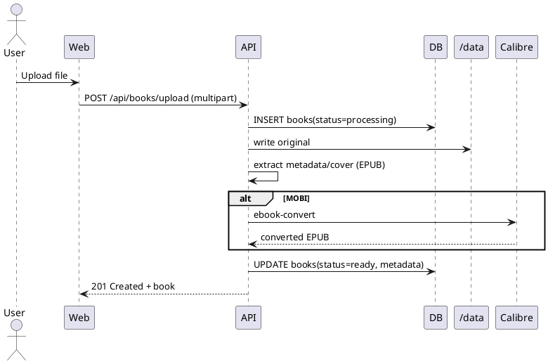
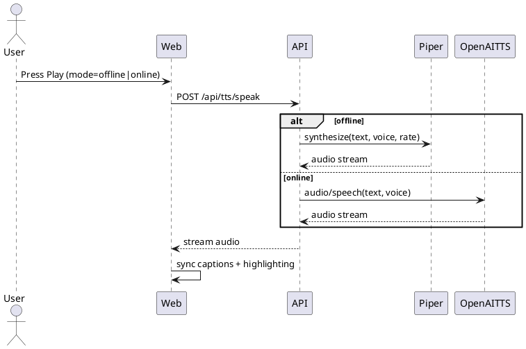

# SPEC-1-Booktainer Re-architecture MVP

## Background

Booktainer is a browser-first, Dockerized reading application intended to run consistently on any platform (Windows/macOS/Linux/iOS/Android) via a simple web UI. Users can upload EPUB, PDF, TXT/MD (and optionally MOBI) files, manage a personal library, read in multiple modes (reflow/paginated EPUB, native EPUB, PDF, and text/markdown), and listen via text-to-speech (TTS).

The current implementation is ~80% complete and consists of:

- **Backend (apps/api)**: Fastify server exposing health, book CRUD, multipart upload, ranged streaming for book files/covers with MIME types, and progress persistence endpoints. SQLite (better-sqlite3) stores `books` and `progress` with WAL mode and indexes. On boot, the server initializes `/data/booktainer.db` plus data directories `/data/library`, `/data/covers`, `/data/tmp`.
- **Ingestion pipeline**: Upload writes originals to `/data/library/<id>/original.ext`, extracts EPUB metadata and covers via JSZip + fast-xml-parser, and optionally runs Calibre `ebook-convert` for MOBI→EPUB with status/metadata updates.
- **Frontend (apps/web)**: React/Vite SPA with library management (upload/search/sort/rename/author/delete) and a reader page that selects a reader by canonical format: custom reflow EPUB reader (two-column pagination), epub.js rendition reader, pdf.js reader (scaling + text extraction), and a scroll-based text/markdown reader with sanitization. Reading progress is throttled and posted to the API and restored on load.
- **TikTok-style mode**: Implemented in `TtsPanel.tsx` as an animated centered caption panel. Text is split into sentence/phrase chunks. Browser `SpeechSynthesisUtterance` drives playback. Phrase changes feed reader highlighting; a timer fallback advances phrases when speech boundary events are missing (Safari mitigation).
- **TTS**: Client-only Web Speech API, with voice selection, rate control, play/pause/stop/next, selection-based start offsets, and auto-advance across EPUB sections.
- **Containerization**: Single multi-stage Docker image (Node 22 build + Node 22 slim runtime) with Calibre installed, non-root runtime user, `/data` volume for persistence, healthcheck on `/api/health`, and compose wiring for env and `./data:/data`.

This redesign effort aims to preserve learnings, reduce rework, modernize runtimes and tooling, improve cross-platform TTS (especially iOS), and make TikTok-style mode more engaging (e.g., background video and richer presentation) while keeping the Dockerized deployment clean and reliable.

## Requirements

### Must have

- **Multi-user support**
  - Support multiple people using the same deployment with separate libraries and reading progress.
  - Each user’s book metadata, files, covers, and progress are isolated from other users.
- **Browser-first reader**
  - Works in modern desktop browsers and mobile browsers (including iOS Safari/WebKit).
  - Reads at minimum: **EPUB**, **PDF**, **TXT/MD**.
- **Upload + library management**
  - Upload files via web UI (multipart), list/search/sort, rename/edit author, delete.
  - Store originals and derived assets persistently under a mounted `/data` volume.
- **Streaming + reading continuity**
  - Efficient streaming for large files (HTTP range requests) with correct MIME types.
  - Persist and restore reading progress per user per book.
- **Text-to-speech with online/offline modes**
  - Provide **offline/local** TTS option (works without internet).
  - Provide **online** TTS option (higher-quality voices, consistent cross-platform, esp. iOS).
  - User can choose TTS mode and voice when applicable.
- **TikTok-style mode (engagement mode)**
  - Animated caption-style reading mode tied to narration with phrase-level highlighting.
  - Works on iOS Safari even when speech boundary events are unreliable (fallback timing).
- **Containerized deployment**
  - Single Docker image (or a minimal compose stack) that is easy to run, persist data, and upgrade.
  - Health endpoint suitable for Docker healthcheck.

### Should have

- **Authentication**
  - Simple auth suitable for self-hosting (e.g., local accounts, magic link, or “invite code”).
  - Optional admin user for user management.
- **Role separation**
  - Admin can manage users and optionally set global policies (upload limits, allowed formats, TTS defaults).
- **Improved TikTok mode visuals**
  - Optional background video/animation layer and more engaging typography/layout.
  - User controls for intensity (motion, background, font size, pacing).
- **Robust ingestion**
  - Extract metadata/covers for EPUB reliably.
  - Optional MOBI support via conversion pipeline (Calibre), with clear status UI.
- **Search quality**
  - Fast library search across title/author/filename; optional full-text search later.
- **Observability**
  - Structured logs and basic metrics (requests, conversion jobs, TTS mode usage) for troubleshooting.

### Could have

- **Multi-device sync semantics**
  - “Last read position” conflict resolution across devices.
- **Sharing**
  - Share a book with another user or create a “family shelf”.
- **Offline-capable PWA**
  - Installable web app with limited offline reading (cached UI + optionally cached books per device).
- **Pluggable TTS providers**
  - Multiple online providers selectable (e.g., provider A/B) + local provider fallback.
- **Engagement analytics (privacy-preserving)**
  - Local-only stats: time spent reading, completion rate, TikTok mode utilization.

### Won’t have (for MVP)

- Public internet hosting features (payments, public catalogs, DRM bypassing).
- Social network features (comments, likes, public profiles).
- Complex enterprise IAM (SAML/OIDC) unless it becomes necessary later.

### Key assumptions (to revisit)

- Deployment is self-hosted (single instance) but used by multiple people (e.g., household/team).
- Data persistence is via a mounted `/data` volume; backups are file-level (SQLite + assets).
- Offline TTS will exist, but voice quality may vary by platform; online TTS is the “best quality” option.


## Method

### Architectural principles (non-negotiables)

These rules exist to keep the implementation **functional, modular, organized, reusable, and strategic**, and to avoid “bolt-on” features later.

- **Single responsibility per module**
  - One clear purpose per file/module; prefer small composable units.
- **Ports-and-adapters boundaries**
  - Core logic depends on interfaces, not implementations (e.g., TTS provider interface, storage interface).
  - Providers/adapters (OpenAI, Piper, filesystem, DB) are replaceable with minimal impact.
- **Feature-first, layered structure**
  - Group code by feature domain (auth, books, progress, tts, jobs) with consistent internal layers.
- **Strict typing + shared contracts**
  - Shared request/response types live in `packages/shared`.
  - Validate at runtime (zod or similar) at API boundaries.
- **No direct DB access from route handlers**
  - Route → service → repository. Services are unit-testable.
- **Streaming is a first-class concern**
  - File streaming and TTS streaming use dedicated utilities; never buffer entire files/audio in memory.
- **Explicit state machines for long-running work**
  - Conversion and voice install are modeled as `jobs` with statuses and retry rules.
- **Cross-platform constraints baked in**
  - iOS Safari: user-gesture gated audio, unreliable boundary events; always include fallbacks.
- **Config-driven behavior**
  - Online TTS appears only if credentials are configured.
  - Offline voice install/download is deterministic and repeatable.
- **Backwards-compatible migrations**
  - DB/file layout changes must ship with migrations and (if needed) one-release compatibility shims.

### Project structure conventions (recommended)

- `apps/api/src/modules/<feature>/`
  - `routes.ts` (Fastify routes; thin)
  - `service.ts` (business logic)
  - `repo.ts` (DB access)
  - `schemas.ts` (zod schemas)
  - `types.ts` (feature-local types)
- `apps/api/src/providers/`
  - `tts/` (`interface.ts`, `openai.ts`, `piper.ts`, `registry.ts`)
- `apps/web/src/features/<feature>/`
  - `components/`, `hooks/`, `api/`, `state/`

### Agent working agreement (how to implement without regressions)

- Every new feature must include:
  - types in `packages/shared`
  - route-level validation
  - service-layer tests (where practical)
  - a short "how to run" note in Runbook if it adds config/ops impact
- Prefer refactors that *reduce* coupling before adding capability.


### Target architecture

Keep the current monorepo split (API + Web + shared types), but make the deployment explicitly **multi-user** and make TTS a **pluggable service** with two modes:

- **Offline/local TTS**: a local engine running in the container (no internet required).
- **Online TTS**: a provider-backed service (higher quality, consistent cross-platform; especially for iOS).

Recommended runtime updates:

- **Node.js**: move Docker/runtime to **Node 24 LTS** (Krypton) (instead of Node 22). ([nodejs.org](https://nodejs.org/en/about/previous-releases?utm_source=chatgpt.com))
- **Fastify**: update to **Fastify v5.x** (current releases show v5.7.1). ([github.com](https://github.com/fastify/fastify/releases?utm_source=chatgpt.com))

### Components

- **apps/api (Fastify)**
  - REST API (books, uploads, streaming, progress)
  - Auth (local accounts + sessions)
  - Ingestion pipeline (metadata extraction + optional conversion)
  - TTS proxy endpoints (online/offline) + optional audio caching
- **apps/web (React/Vite)**
  - Library UI (multi-user aware)
  - Reader UI (EPUB/PDF/TXT/MD)
  - TikTok-mode UI layer (captions + background visuals)
  - TTS controls (mode/voice/rate) and synchronization/highlighting
- **Offline TTS worker (inside same container, separate process)**
  - Python-based Piper engine via `piper-tts` (local neural TTS). ([pypi.org](https://pypi.org/project/piper-tts/?utm_source=chatgpt.com))
  - Exposed only on localhost (or internal docker network) and invoked by API.
- **Online TTS provider (external)**
  - Default: OpenAI Audio `audio/speech` endpoint (or equivalent), called server-side to avoid leaking keys; supports multiple TTS models. ([platform.openai.com](https://platform.openai.com/docs/guides/text-to-speech?utm_source=chatgpt.com))

### Storage layout

Keep `/data` as the persistence root.

- `/data/booktainer.db`
- `/data/library/<userId>/<bookId>/original.<ext>`
- `/data/covers/<userId>/<bookId>.<imgExt>`
- `/data/tmp/...` (ephemeral conversions)
- `/data/tts-cache/<provider>/<voice>/<hash>.mp3` (optional; size-limited)

### API surface (high level)

- Auth
  - `POST /api/auth/register` (optional; can be admin-only)
  - `POST /api/auth/login`
  - `POST /api/auth/logout`
  - `GET  /api/auth/me`
- Books (scoped by user)
  - `GET  /api/books`
  - `POST /api/books/upload`
  - `GET  /api/books/:id`
  - `PATCH/DELETE /api/books/:id`
  - `GET  /api/books/:id/file` (range)
  - `GET  /api/books/:id/cover`
- Progress (scoped by user)
  - `GET  /api/books/:id/progress`
  - `POST /api/books/:id/progress`
- TTS
  - `POST /api/tts/speak` (mode=online|offline, voice, rate, text or textRef)
  - `GET  /api/tts/voices` (returns online voices if configured + offline voices installed)

### Authentication approach

- **Local accounts stored in SQLite**.
- **Admin creates accounts** (no public self-registration for MVP).
- Use **cookie-based sessions** (HTTP-only cookie) to keep browser usage simple.
- Passwords hashed with **Argon2id**.
- Tables: `users`, `sessions`.

### Database schema (SQLite)

Minimal, implementable MVP schema (tables abbreviated to key fields):

- `users`
  - `id TEXT PRIMARY KEY` (uuid)
  - `email TEXT UNIQUE NOT NULL`
  - `password_hash TEXT NOT NULL`
  - `created_at INTEGER NOT NULL`

- `sessions`
  - `id TEXT PRIMARY KEY` (random)
  - `user_id TEXT NOT NULL REFERENCES users(id) ON DELETE CASCADE`
  - `created_at INTEGER NOT NULL`
  - `expires_at INTEGER NOT NULL`
  - `ip TEXT` `user_agent TEXT`
  - indexes: `(user_id)`, `(expires_at)`

- `books`
  - `id TEXT PRIMARY KEY`
  - `user_id TEXT NOT NULL REFERENCES users(id) ON DELETE CASCADE`
  - `title TEXT` `author TEXT`
  - `canonical_format TEXT NOT NULL` (epub|pdf|txt|md|mobi)
  - `original_ext TEXT NOT NULL`
  - `original_path TEXT NOT NULL`
  - `cover_path TEXT`
  - `status TEXT NOT NULL` (ready|processing|failed)
  - `created_at INTEGER NOT NULL` `updated_at INTEGER NOT NULL`
  - indexes: `(user_id, updated_at)`, `(user_id, title)`, `(user_id, author)`

- `progress`
  - `user_id TEXT NOT NULL REFERENCES users(id) ON DELETE CASCADE`
  - `book_id TEXT NOT NULL REFERENCES books(id) ON DELETE CASCADE`
  - `locator_type TEXT NOT NULL` (epub_cfi|pdf_page|text_offset)
  - `locator_json TEXT NOT NULL`
  - `percent REAL` (optional)
  - `updated_at INTEGER NOT NULL`
  - primary key: `(user_id, book_id)`

- `jobs` (optional but recommended for conversion)
  - `id TEXT PRIMARY KEY`
  - `user_id TEXT NOT NULL`
  - `book_id TEXT NOT NULL`
  - `type TEXT NOT NULL` (convert_mobi)
  - `status TEXT NOT NULL` (queued|running|succeeded|failed)
  - `detail TEXT` (error/status)
  - `created_at INTEGER` `updated_at INTEGER`
  - indexes: `(status)`, `(user_id, created_at)`

### TikTok-style mode upgrade (MVP-safe)

Goal: more engaging visuals without making the reader logic brittle.

- Keep the current phrase segmentation + highlighting contract.
- Add a **presentation layer** that can render:
  - caption card + kinetic typography presets
  - optional background video loop (local file shipped with web assets, or user-selectable from a small built-in set)
  - optional blur/gradient overlay to preserve legibility
- Timing
  - Primary: speech boundary events when available.
  - Fallback: duration estimation (words-per-minute derived from speech rate) + adaptive correction.

### TTS providers

To keep the app **provider-agnostic**, implement a server-side provider interface and ship multiple adapters.

Provider interface:

- `listVoices(): Voice[]`
- `speak(text, voice, rate, format, opts): ReadableStream` (mp3/ogg/wav)

Adapters (MVP):

- **Offline**: Piper via the actively maintained repository `OHF-Voice/piper1-gpl` using the `piper-tts` Python package.
  - Voices are **downloaded into `/data/tts-voices` on first use**.
  - Note: this repo uses **GPLv3**; for commercial redistribution, prefer “download-at-runtime” voice management and keep the TTS microservice clearly separable.
- **Online (default for MVP)**:
  - **OpenAI Audio `audio/speech`** endpoint (server-side; consistent cross-platform)
- **Online (optional adapters later)**:
  - ElevenLabs streaming TTS
  - Azure Speech TTS (enterprise-friendly)

MVP behavior:

- If online provider credentials are configured, user can switch between **Online** and **Offline** in UI.
- If no online credentials are configured, UI hides online option and uses offline only.

### Container strategy

- Keep a single image but run two processes:
  - `node apps/api/dist/server.js`
  - `python -m booktainer_offline_tts` (Piper microservice)
- Use a tiny process supervisor (e.g., `tini` + a small shell script) or Fastify-managed child process.
- Continue mounting `/data` for persistence; keep Calibre for MOBI conversion.

### PlantUML diagrams

#### Component diagram

```plantuml
@startuml
skinparam componentStyle rectangle

component "Browser
(React SPA)" as Web
component "Booktainer API
(Fastify)" as API
database "SQLite
/booktainer.db" as DB
folder "/data
(library/covers/tmp)" as DATA
component "Offline TTS
(Piper service)" as Piper
cloud "Online TTS
(OpenAI Audio API)" as OpenAITTS

Web --> API : HTTPS (JSON + streams)
API --> DB : SQL
API --> DATA : file IO (streams)
API --> Piper : localhost HTTP/IPC
API --> OpenAITTS : HTTPS

@enduml
```

#### Upload + ingestion sequence



#### TTS speak sequence




## Runbook

### Build and run

- **Docker (single container)**
  - Exposes: `8080/tcp` (configurable)
  - Persists: `/data` volume
  - Healthcheck: `GET /api/health`

Example (Compose):

- Mount `./data:/data`
- Set environment variables (below)

### Environment variables

**Core**

- `PORT` (default `8080`)
- `DATA_DIR` (default `/data`)
- `ALLOW_UPLOAD` (`true|false`, default `true`)
- `MAX_UPLOAD_MB` (default `200`)

**Auth**

- `SESSION_SECRET` (required in multi-user; long random string)
- `SESSION_TTL_DAYS` (default `30`)
- `ADMIN_EMAIL` (optional; used to bootstrap first admin)
- `ADMIN_PASSWORD` (optional; used to bootstrap first admin)

**Online TTS (OpenAI)**

- `OPENAI_API_KEY` (optional; enables online TTS)
- `OPENAI_TTS_MODEL` (default e.g. `gpt-4o-mini-tts`)
- `OPENAI_TTS_VOICE` (default voice name; overridable per request)

**Offline TTS (Piper)**

- `PIPER_VOICES_DIR` (default `/data/tts-voices`)
- `PIPER_DEFAULT_VOICE` (optional)

**Optional caching**

- `TTS_CACHE_DIR` (default `/data/tts-cache`)
- `TTS_CACHE_MAX_MB` (default `2048`)

### First-time setup

1) Start the container with `/data` mounted.
2) Bootstrap an admin:
   - Option A: set `ADMIN_EMAIL` + `ADMIN_PASSWORD` for first run.
   - Option B: run a one-off CLI inside container (recommended): `node apps/api/dist/scripts/create-admin.js`.
3) Log in as admin and create user accounts.
4) (Optional) Configure online TTS by setting `OPENAI_API_KEY`.
5) Install an offline voice on first use (downloads to `/data/tts-voices`).

### Backups and restores

**Backup** (stop container if possible):

- `/data/booktainer.db`
- `/data/library/**`
- `/data/covers/**`
- `/data/tts-voices/**` (if using offline)
- `/data/tts-cache/**` (optional)

**Restore**

- Place the above into the mounted `/data` and restart the container.

### Upgrades and migrations

- API runs DB migrations on startup.
- Keep migrations **idempotent** and forward-only.
- For breaking file layout changes, include a one-time migration step:
  - legacy `/data/library/<bookId>` → new `/data/library/<userId>/<bookId>`

### Troubleshooting

- **Healthcheck failing**: verify `PORT`, inspect logs, hit `/api/health`.
- **Uploads failing**: check `ALLOW_UPLOAD`, `MAX_UPLOAD_MB`, disk space on `/data`.
- **Conversion stuck**: check `jobs` table status, verify Calibre installed in image.
- **Online TTS not showing**: ensure `OPENAI_API_KEY` present; API should hide online voices if not configured.
- **iOS audio issues**: ensure audio playback is user-initiated (tap), and use `audio.play()` after a gesture.

## Implementation

1) **Modernize baseline and lock toolchain**
   - Upgrade Docker image to Node 24 LTS.
   - Upgrade Fastify to v5.
   - Pin package manager + lockfile; ensure deterministic workspace installs.

2) **Multi-user auth + request scoping**
   - Add `users` + `sessions` tables and migration.
   - Implement admin-only user creation endpoint + minimal admin UI route.
   - Add session middleware that attaches `req.user`.
   - Scope all book/progress queries by `user_id`.

3) **Data layout migration**
   - Move assets to `/data/library/<userId>/<bookId>/...` and `/data/covers/<userId>/...`.
   - Add a one-time migration that:
     - creates a default admin + default user (if legacy install)
     - assigns legacy books/progress to the default user
     - relocates files on disk (or supports both layouts with a compatibility layer for one release).

4) **TTS service layer (provider-agnostic)**
   - Define provider interface and a registry.
   - Implement offline Piper adapter:
     - `/api/tts/voices` lists installed Piper voices
     - `/api/tts/install-voice` downloads voice to `/data/tts-voices` (admin-only or per-user)
     - `/api/tts/speak` streams audio
   - Implement online adapter (OpenAI first):
     - Server-side credentials via env vars
     - `/api/tts/voices` merges online + offline lists

5) **Frontend TTS UX**
   - Add mode selector (Offline / Online) + voice selector.
   - Switch from Web Speech API playback to **HTMLAudio streaming** from `/api/tts/speak`.
   - Keep phrase segmentation/highlighting pipeline; tie phrase timing to:
     - streaming chunk receipt events (coarse)
     - estimated durations + adaptive correction (fine)

6) **TikTok-style mode upgrade**
   - Refactor TikTok presentation into its own component (pure UI layer).
   - Add background video presets (bundled web assets) + optional overlay controls.
   - Add pacing controls (words-per-phrase, pause between phrases, emphasis animations).
   - Ensure iOS-friendly rendering (avoid heavy filters; prefer transform/opacity animations).

7) **Ingestion + conversion hardening**
   - Keep Calibre conversion job support; move conversions into a `jobs` table with polling.
   - Ensure uploads are per-user and enforce per-user size limits.

8) **Operational hardening**
   - Add backup guidance: copy `/data/booktainer.db` + `/data/library` + `/data/covers` + `/data/tts-*`.
   - Add structured logs and basic request logging.
   - Add minimal integration tests: auth, upload, range streaming, progress, TTS speak.

## Milestones

1) **M1 — Baseline modernization (1–2 days)**
   - Node 24 + Fastify v5 upgrades
   - Docker build/run green

2) **M2 — Multi-user auth (2–4 days)**
   - SQLite users/sessions
   - Admin user creation
   - Per-user scoping for books + progress

3) **M3 — Data migration + compatibility (1–3 days)**
   - `/data` layout change
   - Legacy migration path

4) **M4 — Provider-agnostic TTS (3–6 days)**
   - Offline Piper service + voice download-on-first-use
   - One online provider adapter
   - Frontend audio streaming playback

5) **M5 — TikTok mode v2 (2–5 days)**
   - Background visuals + pacing controls
   - iOS Safari performance pass

6) **M6 — Stabilization + release (2–4 days)**
   - Test matrix (iOS/Android/Desktop)
   - Runbook + OpenAPI
   - Tagged Docker image release


## Milestones

(TBD — trackable delivery milestones.)

## Gathering Results

### Success metrics (local-only)

Engagement and completion are evaluated **without sending data off-box**.

- **Time spent reading**
  - Total reading time per user per day/week.
  - Time in standard reading vs TikTok-style mode.
- **Completion rate**
  - % of books reaching 90%+ completion.
  - Median time-to-complete by format (EPUB/PDF/TXT/MD).

### Reliability and UX quality gates

- **Cross-platform TTS parity**
  - iOS Safari: narration works reliably using streamed audio (not browser speech synthesis).
  - Switching Offline/Online modes works without breaking highlighting/timing.
- **Reader correctness**
  - EPUB: resume to exact section/CFI, accurate highlighting.
  - PDF: resume to page/offset; text extraction present where possible.
  - TXT/MD: resume to offset and maintain scroll position.
- **Performance**
  - Upload + index operations remain responsive with 1k+ books.
  - Range streaming supports large files without full buffering.
  - TikTok mode maintains smooth animation on iOS (avoid heavy GPU filters).
- **Operations**
  - Backups/restores verified (SQLite + assets + TTS voices/cache).
  - Upgrades verified with migration tests.

### Local analytics implementation (MVP)

Add a simple table to track sessions (optional but recommended):

- `reading_sessions`
  - `id TEXT PRIMARY KEY`
  - `user_id TEXT NOT NULL`
  - `book_id TEXT NOT NULL`
  - `mode TEXT NOT NULL` (read|tiktok)
  - `started_at INTEGER NOT NULL`
  - `ended_at INTEGER NOT NULL`
  - `seconds INTEGER NOT NULL`
  - indexes: `(user_id, started_at)`, `(book_id, started_at)`

The frontend records a session on:

- reader open → `started_at`
- tab hidden/unload or idle timeout → `ended_at`

Aggregate queries for “time spent” and “completion” power a small local dashboard.


## Need Professional Help in Developing Your Architecture?

Please contact me at [sammuti.com](https://sammuti.com) :)

